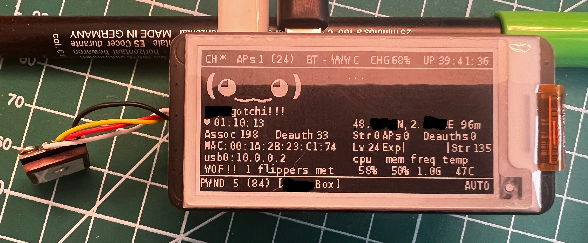

# GPSD-ng
Use GPSD server to retreive and save coordinates on handshake. Can use mutiple gps device (gps modules, USB dongle, phone, etc.)



__Advantages__:
- GPS configuration independant from pwnagotchi
- Early position polling
- No position lost on bettercap/pwnagotchi restarts
- High compatibility (device, protocol, vendor, version): NMEA/ublox modules (Serial), USB modules, Android/IPhone
- Non blocking access to GPS information, no deadlock, 
- GPS hotplugin
- Compatibility with other applications like chrony
- Compatible with NTRIP/RTK/RTCM

__Exemple__:\
GPS module/dongle and/or Phone (IOS/Android) ------> GPSD ------> GPSD-ng ------> Pwnagotchi

# Install
- Install gpsd:
  - "apt-get install gpsd gpsd-clients python3-gps" or compile from gpsd repository
  - Be sure to have the native gpsd python library installed (python3-gps)
- Check in raspi-config -> Interface Options -> Serial Port:
  - __Disable__ Serial Port login
  - __Enable__ Serial Port 
- Configure GPSD (/etc/default/gpsd) and uncomment one DEVICES:
```
# Default settings for the gpsd init script and the hotplug wrapper.

# Start the gpsd daemon automatically at boot time
START_DAEMON="true"

# Use USB hotplugging to add new USB devices automatically to the daemon
USBAUTO="false"

# Devices gpsd should collect to at boot time.
# They need to be read/writeable, either by user gpsd or the group dialout.
# DEVICES="-s BAUDRATE /dev/ttyS0" # GPS module only
# DEVICES="tcp://PHONEIP:4352" # Phone only over BT tether
# DEVICES="-s BAUDRATE /dev/ttyS0 tcp://PHONEIP:4352" # GPS module + phone

# Other options you want to pass to gpsd
GPSD_OPTIONS="-n" # add -D3 if you need to debug
```
- If you use a phone:
  - Setup bt-tether and check you can ping your phone
  - Install a GPS app:
    - __Android__(not tested):
      - BlueNMEA: https://github.com/MaxKellermann/BlueNMEA
      - gpsdRealay: https://github.com/project-kaat/gpsdRelay
    - __IOS__: GPS2IP (tested but paid app)
      - Set "operate in background mode"
      - Set "Connection Method" -> "Socket" -> "Port Number" -> 4352
      - Set "Network selection" -> "Hotspot"
    - Both cases activate GGA messages to have "3D fix"
- Check your gpsd configuration with gpsmon or cgps
- Copy gpsd-ng.py into your custom plugin directory and configure

# Config.toml
```
main.plugins.gpsd.enabled = true

# Options with default settings.
# Don't add if you don't need customisation
main.plugins.gpsd-ng.gpsdhost = "127.0.0.1"
main.plugins.gpsd-ng.gpsdport = 2947
main.plugins.gpsd-ng.main_device = "/dev/ttyS0" # if not provided, the puglin will try to retreive the most accurate position
main.plugins.gpsd-ng.use_open_elevation = true # if true, use open-elevation API to retreive missing altitudes. Use it if you have a poor GPS signal.
main.plugins.gpsd-ng.save_elevations = true # if true, elevations cache will be saved to disk. Be carefull as it can grow fast if move a lot.
main.plugins.gpsd-ng.view_mode = "compact" # "compact", "full", "none" 
main.plugins.gpsd-ng.fields = "info,speed,altitude" # list or string of fields to display
main.plugins.gpsd-ng.units = "metric" # "metric", "imperial"
main.plugins.gpsd-ng.position = "127,64"
main.plugins.gpsd-ng.lost_face_1 = "(O_o )"
main.plugins.gpsd-ng.lost_face_2 = "( o_O)"
main.plugins.gpsd-ng.face_1 = "(•_• )"
main.plugins.gpsd-ng.face_2 = "( •_•)"
```

# Usage
## Retreive GPS Position
This plugin can be used for wardriving with the wigle plugin, for example.
- __Outdoor__: GPS module/dongle works fine. 
- __Indoor__: is the GPS module/dongle doesn't work, you can use your phone.

This plugin select the most accurate (base on fix information) and most recent position.

If the device can only get 2D positions for some reason (poor signal, wrong device orientation, bad luck, etc.), the plugin can use open-elevation API to try to ask current altitude.
To avoid many call to the API, each request asks for points every ~10m around you, in a diameter of 200m. This cache can be saved to disk.

## Improve positioning with RTCM (need gpsd 3.25)
If you have a GPs module or dongle with RTCM capabilities, you can activate with GPSD.
Exemple with a Ublox (firmware 34.10) and GPSD 3.25:
- ublox setup:
  - ubxtool -p MON-VER | grep PROT  -> retreive ublox version XX.YY (34.10 for me)
  - export UBXOPTS="-P XX.YY -v 2"
  - ubxtool -e RTCM3
- GPSD setup:
  - Find a local (< 30km) RTK provider (https://rtkdata.online/network)
  - You need host/port and mountpoint information
  - Check with the following command. It should stream binary data.\
curl -v -H "Ntrip-Version: Ntrip/2.0" -H "User-Agent: NTRIP theSoftware/theRevision" http://[user:pwd@]host:2101/mountpoint -o -
  - Add "ntrip://[user:pwd@]host:2101/mountpoint" to DEVICES in GPSD configuration
  - Now GPSD command should look like with ps: 'gpsd -n ntrip://host:2101/MOUNTPOINT -s 38400 /dev/ttyS0'

Of course, you can still append your phone 'gpsd -N -D3 ntrip://host:2101/MOUNTPOINT -s 38400 /dev/ttyS0 tcp://172.20.10.1:4352'
More info on: https://gpsd.gitlab.io/gpsd/ubxtool-examples.html#_survey_in_and_rtcm

## UI views
The "compact" view mode (default) option show gps informations, on one line, in rotation:
- Latitude,Longitude
- Info: Device source + Fix information
- Speed, Altitude

If you prefer a more traditionnal view, use "full" mode:
- Latitude
- Longitude
- Altitude
- Speed

You can show or not with the fields option. by default, it will display all.
If you want a clear display, use "none", nothing will be display.

# Units
You can use metric or imperial units for altitude(m or ft) and speed (m/s or ft/s).
This only changes on display, not gps.json files, as Wigle needs metric units. 
Default is metric because it's the International System. 

## Handshake
- Set gps position to bettercap (it's also done on internet_available)
- Saves position informations into "gps.json" (compatible with Wigle and webgpsmap)

## Bettercap
Gps option is set to off. Position is update in Bettercap everytime a handshake is captured.

# TODO
- [ ] Run around the World!
 
# Based on:
- https://github.com/evilsocket
- https://github.com/kellertk/pwnagotchi-plugin-gpsd
- https://github.com/nothingbutlucas/pwnagotchi-plugin-gpsd
- https://gpsd.gitlab.io/gpsd/index.html

Have fun !
